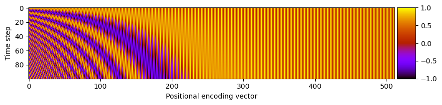

# Simple Diffusion Model

Implementation of [Denoising Diffusion Probabilistic Models](https://arxiv.org/abs/2006.11239).

## Implementation

### Positional encoding

The transformer sinusoidal positional encoding is used to encode the time step of each sample.

```
class PositionalEncoding(nn.Module):
    def __init__(self, max_time_steps: int, embedding_size: int, n: int = 10000) -> None:
        super().__init__()

        i = torch.arange(embedding_size // 2)
        k = torch.arange(max_time_steps).unsqueeze(dim=1)

        self.pos_embeddings = torch.zeros(max_time_steps, embedding_size, requires_grad=False)
        self.pos_embeddings[:, 0::2] = torch.sin(k / (n ** (2 * i / embedding_size)))
        self.pos_embeddings[:, 1::2] = torch.cos(k / (n ** (2 * i / embedding_size)))

    def forward(self, t: Tensor) -> Tensor:
        return self.pos_embeddings[t, :]
```

The figure below shows the elements of each positional encoding vector plotted along the x-axis for each time step on the y-axis (see code [here](scripts/positional_encoding_example.py)).



### ResNet block, w/ positional encoding injection

The positional encoding is injected with a modified ResNet block.

```
class ResNetBlock(nn.Module):
    """ResNet block with injection of positional encoding."""

    def __init__(
        self, in_size: int, out_size: int, t_dim: Optional[int] = None, activation: Callable = nn.SiLU, stride: int = 1
    ) -> None:
        super().__init__()

        self.act = activation(inplace=False)

        if t_dim is not None:
            self.t_proj = nn.Sequential(self.act, nn.Linear(t_dim, out_size))
        else:
            self.t_proj = None

        self.conv1 = conv3x3(in_size, out_size, stride=stride)
        self.bn1 = nn.BatchNorm2d(out_size)
        self.conv2 = conv3x3(out_size, out_size)
        self.bn2 = nn.BatchNorm2d(out_size)

        if in_size != out_size:
            self.skip_conv = nn.Sequential(conv1x1(in_size, out_size, stride), nn.BatchNorm2d(out_size))
        else:
            self.skip_conv = None

    def forward(self, x: Tensor, t_emb: Tensor = None) -> Tensor:
        x_skip = x

        if self.skip_conv is not None:
            x_skip = self.skip_conv(x_skip)

        # First hidden layer.
        x = self.conv1(x)
        x = self.bn1(x)
        x = self.act(x)

        # Inject positional encoding in hidden state.
        if t_emb is not None and self.t_proj is not None:
            t_emb = self.t_proj(t_emb)
            x = rearrange(t_emb, "b c -> b c 1 1") + x

        # Second hidden layer.
        x = self.conv2(x)
        x = self.bn2(x)

        # Residual connection + activation.
        x += x_skip
        out = self.act(x)

        return out
```
